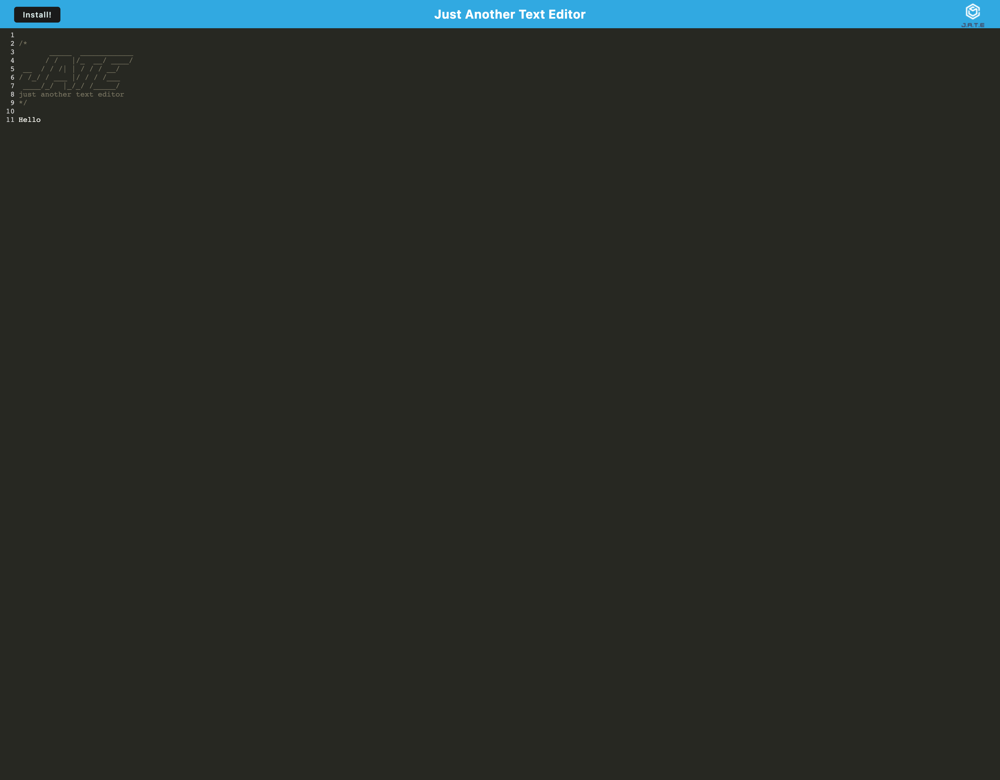

# 19 Progressive Web Applications: Text Editor

## Table of Contents
- [Description](#description)
- [Developer Notes](#developer-notes)
- [Installation](#installation)
- [Usage](#usage)
- [Screenshot of Deployed Application](#screenshot-of-deployed-application)
- [Questions](#questions)

## Description
This is a text editor application that allows users to create and save notes. It uses an Express.js back end and saves and retrieves note data from a JSON file.
- The application is designed to work offline and is installable.

## Developer Notes
This application requires a .npmrc file with the following information:
- 'production=false'
- 'progress=false'
Without this file, the application will not run properly and will not be able to be deployed to Heroku.

## Installation (for local use)
- Clone the repository
- Run `npm install` to install dependencies
- Run `npm start` to run the build and start the server
- Go to the 'Dist' folder and open the index.html file in your browser

## Usage
- The application is deployed at https://ancient-earth-71719.herokuapp.com/
- To use the application, simply take notes in the space provided and the notes will automatically save
- To install the application locally, click the install button in the address bar of your browser

## Screenshot of Deployed Application

## Questions
- If you have any questions about this repository, please contact me at https://github.com/ionscion
